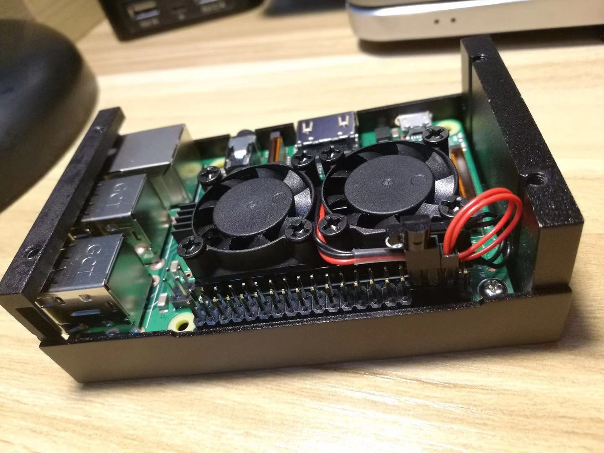
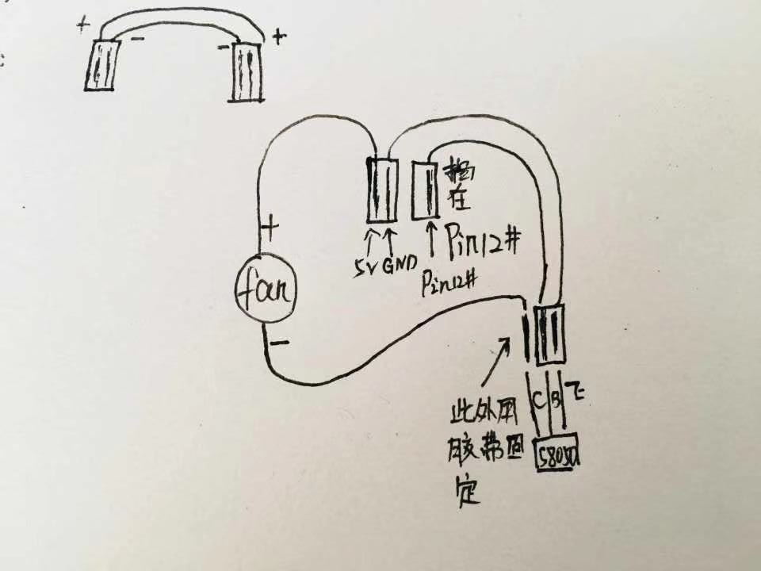

# Raspberry-cpu-fan

我们再给树莓派加风扇的时候通常都是插上后主机接上电源一直转的那种，其实当主机温度低的时候没必要一直开着风扇进行散热，一来呢是有噪音，二来是耗电。这个项目就是为了解决这个问题，安装后可以根据温度自动控制散热风扇的开关。



所需材料：
> 1、风扇
> 2、杜邦线
> 3、三极管
> 4、树莓派开发板

连接方式：




### 前提

作者使用的是 [Raspbian Stretch Lite](https://www.raspberrypi.org/downloads/raspbian/) 版本的系统，以下所用的命令都基于这个系统上跑的，不同系统可能有一些差别，如果出现了问题欢迎提 [Issues](https://github.com/sanonz/raspberry-cpu-fan/issues) 一起探讨。

因为这个项目用了 nodejs，所以需要先安装才能使用，如果安装过了可以跳过
```bash
curl -sL https://deb.nodesource.com/setup_11.x | sudo -E bash -
sudo apt-get install -y nodejs
```

安装后执行以下命令查看是否成功，有版本输入则代表安装成功
```bash
$ node -v
v11.9.0
```

### 安装

Git 方式安装

```bash
$ git clone https://github.com/sanonz/raspberry-cpu-fan.git
$ cd raspberry-cpu-fan
$ npm install
$ pwd
/home/pi/raspberry-cpu-fan # 记录这个路径，下边添加自启动要用到
```

或者 [直接下载](https://github.com/sanonz/raspberry-cpu-fan/archive/master.zip) 压缩包然后解压


### 升级

``` bash
$ cd raspberry-cpu-fan
$ git pull
```

### 配置

修改 `template.json` 配置文件

```json
{
  "pin": 8,
  "min": 45,
  "max": 50,
  "interval": 3000
}
```

- **pin** - 控制风扇开关的针脚，要和实际排线对应。
- **min** - 最小温度，当温度小于此值时关闭风扇，单位：℃。
- **max** - 最大温度，当温度大于此值时关闭风扇，单位：℃。
- **interval** - 多久检查一次温度，单位毫秒。

添加开机启动脚本

```bash
$ sudo nano /etc/rc.local
#!/bin/sh -e
#
# rc.local
#
# This script is executed at the end of each multiuser runlevel.
# Make sure that the script will "exit 0" on success or any other
# value on error.
#
# In order to enable or disable this script just change the execution
# bits.
#
# By default this script does nothing.

# Print the IP address
_IP=$(hostname -I) || true
if [ "$_IP" ]; then
  printf "My IP address is %s\n" "$_IP"
fi

node /home/pi/raspberry-cpu-fun/index.js & # 增加这一行，放在 `exit 0` 前边，路径使用上方记录的

exit 0
```

添加完成后按 `ctrl+X` 然后按 `Y` 保存修改

然后赶紧重启你的树莓派试下吧。


### 小结

1、三极管的辨别方式，以 S8050 为例，拿着三极管三脚朝下，头部有文字的一面朝相自己，三脚从左向右一次为 `E、B、C` 脚。

2、配置文件使用了两个（最大/最小温度）值来判断风扇的开关，而没有直接使用一个值进行控制，是因为防止温度在这个值的上下来回徘徊而导致风扇不停的开关，最大/最小值的差尽量大于或等于5℃。
